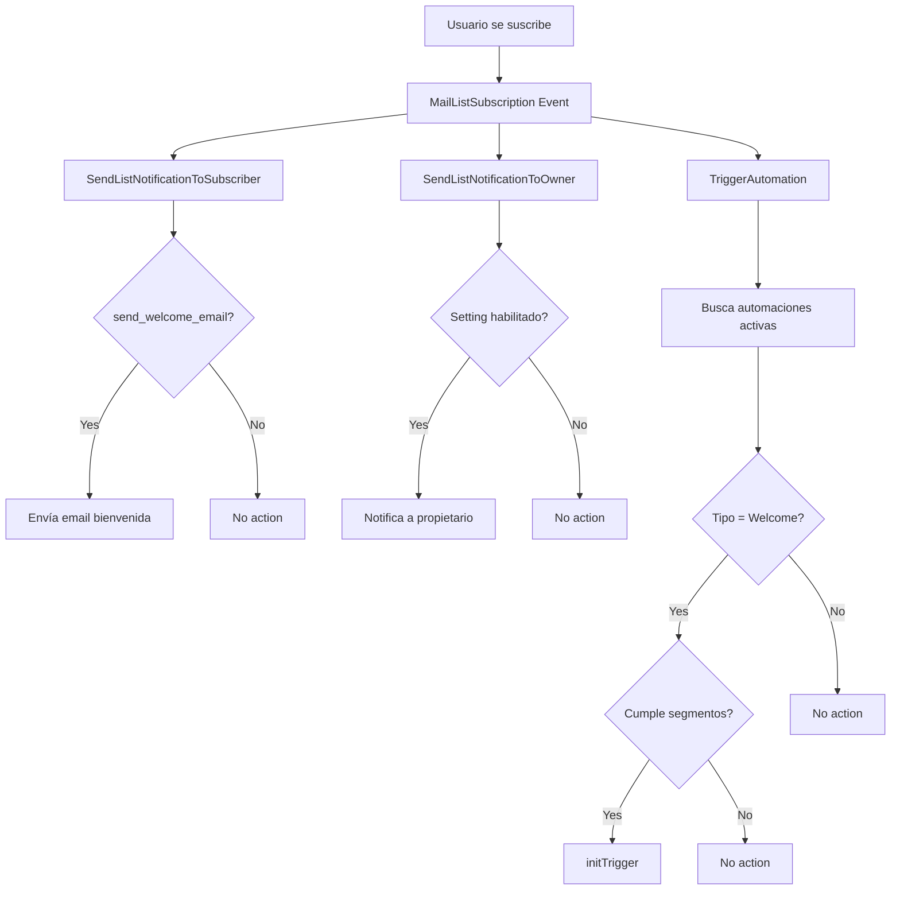
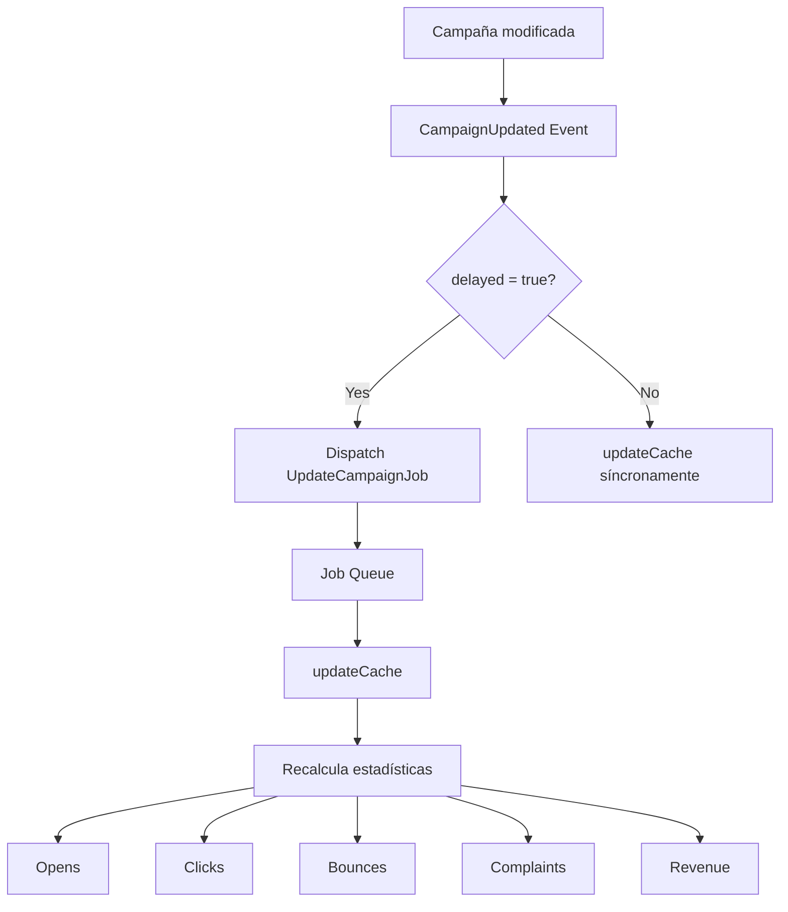
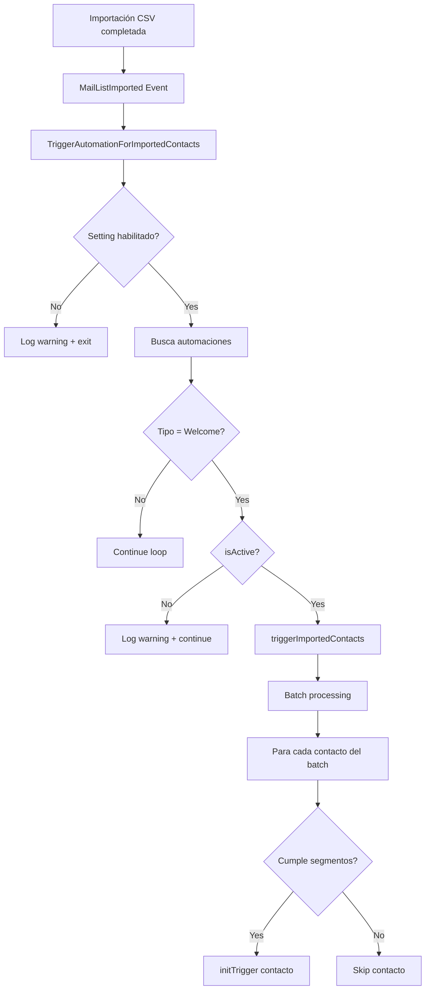
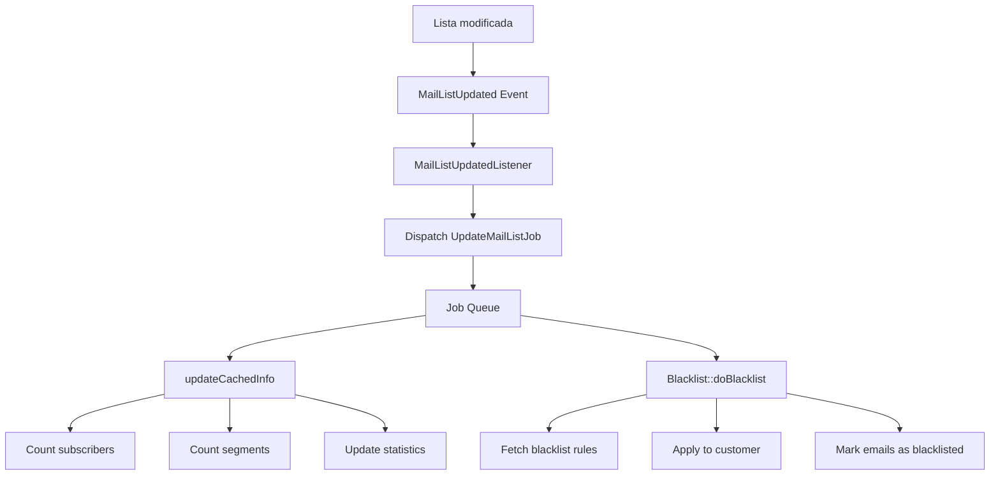
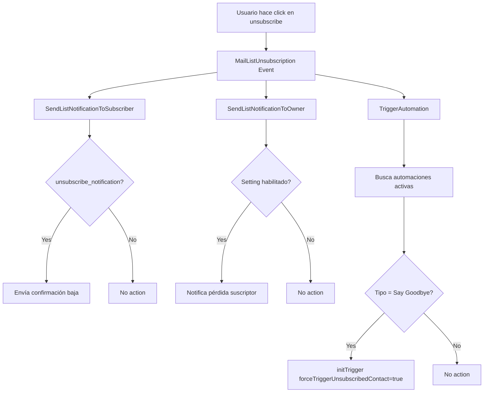

# Acelle Events and Listeners Analysis

**Documento generado:** 2026-01-29
**Analizado desde:** `/Users/functionbytes/Function/Coding/acelle/app/Events/` y `/app/Listeners/`
**Propósito:** Mapeo completo del sistema de eventos de Acelle para integración en el módulo Mailing

---

## Tabla de Contenidos

1. [Resumen Ejecutivo](#resumen-ejecutivo)
2. [Arquitectura del Sistema de Eventos](#arquitectura-del-sistema-de-eventos)
3. [Catálogo de Eventos](#catálogo-de-eventos)
4. [Catálogo de Listeners](#catálogo-de-listeners)
5. [Eventos Críticos para Mailing](#eventos-críticos-para-mailing)
6. [Flujos de Eventos Importantes](#flujos-de-eventos-importantes)
7. [Implementación en Laravel 12](#implementación-en-laravel-12)
8. [Recomendaciones para Migración](#recomendaciones-para-migración)

---

## Resumen Ejecutivo

### Estadísticas Generales

- **Total de Eventos:** 9 eventos
- **Total de Listeners:** 9 listeners
- **Eventos Críticos para Mailing:** 5 eventos principales
- **Patrones de Arquitectura:** Event-driven con Queue Jobs asíncronos

### Clasificación de Eventos por Prioridad

| Prioridad | Cantidad | Descripción |
|-----------|----------|-------------|
| **Crítica** | 5 | Eventos de suscripción, campañas, listas |
| **Media** | 2 | Eventos de usuarios y administración |
| **Baja** | 2 | Eventos de sistema (cron, login admin) |

---

## Arquitectura del Sistema de Eventos

### Estructura de Archivos

```
acelle/app/
├── Events/
│   ├── Event.php                      # Clase abstracta base
│   ├── MailListSubscription.php       # ⭐ Crítico
│   ├── MailListUnsubscription.php     # ⭐ Crítico
│   ├── MailListUpdated.php            # ⭐ Crítico
│   ├── MailListImported.php           # ⭐ Crítico
│   ├── CampaignUpdated.php            # ⭐ Crítico
│   ├── UserUpdated.php
│   ├── AdminLoggedIn.php
│   └── CronJobExecuted.php
│
└── Listeners/
    ├── SendListNotificationToSubscriber.php    # ⭐ Crítico
    ├── SendListNotificationToOwner.php         # ⭐ Crítico
    ├── TriggerAutomation.php                   # ⭐ Crítico
    ├── TriggerAutomationForImportedContacts.php # ⭐ Crítico
    ├── MailListUpdatedListener.php             # ⭐ Crítico
    ├── CampaignUpdatedListener.php             # ⭐ Crítico
    ├── UserUpdatedListener.php
    ├── AdminLoggedInListener.php
    └── CronJobExecutedListener.php
```

### Patrón de Registro de Eventos

Acelle utiliza dos métodos de registro en `EventServiceProvider`:

1. **Mapeo directo ($listen):** Eventos con listeners únicos
2. **Subscribers ($subscribe):** Listeners que manejan múltiples eventos

```php
// EventServiceProvider.php
protected $listen = [
    'Acelle\Events\CampaignUpdated' => [
        'Acelle\Listeners\CampaignUpdatedListener',
    ],
    'Acelle\Events\MailListImported' => [
        'Acelle\Listeners\TriggerAutomationForImportedContacts',
    ],
];

protected $subscribe = [
    'Acelle\Listeners\TriggerAutomation',           // Maneja subscription + unsubscription
    'Acelle\Listeners\SendListNotificationToOwner',
    'Acelle\Listeners\SendListNotificationToSubscriber',
];
```

---

## Catálogo de Eventos

### 1. MailListSubscription ⭐ CRÍTICO

**Archivo:** `app/Events/MailListSubscription.php`

```php
namespace Acelle\Events;

class MailListSubscription
{
    use Dispatchable, InteractsWithSockets, SerializesModels;

    public $subscriber;

    public function __construct(Subscriber $subscriber)
    {
        $this->subscriber = $subscriber;
    }
}
```

**Propósito:** Se dispara cuando un suscriptor se añade a una lista de correo

**Datos del Evento:**
- `$subscriber` (Subscriber): Modelo del suscriptor que se suscribió

**Listeners Registrados:**
1. `SendListNotificationToSubscriber::handleMailListSubscription()`
2. `SendListNotificationToOwner::handleMailListSubscription()`
3. `TriggerAutomation::handleMailListSubscription()`

**Cuándo se Dispara:**
- Nuevo suscriptor confirmado
- Importación de contactos (si configurado)
- Suscripción manual desde el panel

**Prioridad:** ⭐⭐⭐⭐⭐ (Máxima)

---

### 2. MailListUnsubscription ⭐ CRÍTICO

**Archivo:** `app/Events/MailListUnsubscription.php`

```php
namespace Acelle\Events;

class MailListUnsubscription
{
    use Dispatchable, InteractsWithSockets, SerializesModels;

    public $subscriber;

    public function __construct(Subscriber $subscriber)
    {
        $this->subscriber = $subscriber;
    }
}
```

**Propósito:** Se dispara cuando un suscriptor se da de baja de una lista

**Datos del Evento:**
- `$subscriber` (Subscriber): Modelo del suscriptor que se desuscribió

**Listeners Registrados:**
1. `SendListNotificationToSubscriber::handleMailListUnsubscription()`
2. `SendListNotificationToOwner::handleMailListUnsubscription()`
3. `TriggerAutomation::handleMailListUnsubscription()`

**Cuándo se Dispara:**
- Click en enlace de unsubscribe
- Desuscripción manual desde el panel
- Baja automática por bounce o complaint

**Prioridad:** ⭐⭐⭐⭐⭐ (Máxima)

---

### 3. MailListUpdated ⭐ CRÍTICO

**Archivo:** `app/Events/MailListUpdated.php`

```php
namespace Acelle\Events;

class MailListUpdated
{
    use Dispatchable, InteractsWithSockets, SerializesModels;

    public $mailList;
    public $delayed;

    public function __construct($mailList, $delayed = true)
    {
        $this->mailList = $mailList;
        $this->delayed = $delayed;
    }
}
```

**Propósito:** Se dispara cuando una lista de correo es modificada

**Datos del Evento:**
- `$mailList` (MailList): Lista de correo actualizada
- `$delayed` (bool): Si debe procesarse de forma asíncrona (default: true)

**Listeners Registrados:**
1. `MailListUpdatedListener::handle()`

**Cuándo se Dispara:**
- Cambios en configuración de la lista
- Actualización de campos personalizados
- Modificación de reglas de segmentación

**Acción Resultante:**
- Despacha `UpdateMailListJob` para recalcular caché
- Ejecuta blacklist de emails

**Prioridad:** ⭐⭐⭐⭐ (Alta)

---

### 4. MailListImported ⭐ CRÍTICO

**Archivo:** `app/Events/MailListImported.php`

```php
namespace Acelle\Events;

class MailListImported
{
    use Dispatchable, InteractsWithSockets, SerializesModels;

    public $list;
    public $importBatchId;

    public function __construct(MailList $list, $importBatchId)
    {
        $this->list = $list;
        $this->importBatchId = $importBatchId;
    }
}
```

**Propósito:** Se dispara cuando se completa la importación de contactos a una lista

**Datos del Evento:**
- `$list` (MailList): Lista que recibió la importación
- `$importBatchId` (string): ID único del lote de importación

**Listeners Registrados:**
1. `TriggerAutomationForImportedContacts::handle()`

**Cuándo se Dispara:**
- Finalización exitosa de importación CSV
- Importación desde API
- Sincronización de contactos externos

**Acción Resultante:**
- Trigger de automaciones "Welcome New Subscriber" (si configurado)
- Respeta la configuración `automation.trigger_imported_contacts`

**Prioridad:** ⭐⭐⭐⭐ (Alta)

---

### 5. CampaignUpdated ⭐ CRÍTICO

**Archivo:** `app/Events/CampaignUpdated.php`

```php
namespace Acelle\Events;

class CampaignUpdated extends Event
{
    use SerializesModels;

    public $campaign;
    public $delayed;

    public function __construct($campaign, $delayed = true)
    {
        $this->campaign = $campaign;
        $this->delayed = $delayed;
    }
}
```

**Propósito:** Se dispara cuando una campaña de email es actualizada

**Datos del Evento:**
- `$campaign` (Campaign): Campaña actualizada
- `$delayed` (bool): Si debe procesarse de forma asíncrona (default: true)

**Listeners Registrados:**
1. `CampaignUpdatedListener::handle()`

**Cuándo se Dispara:**
- Guardado de borrador
- Cambios en contenido HTML
- Actualización de segmentación o programación

**Acción Resultante:**
- Despacha `UpdateCampaignJob` para recalcular caché
- Si `$delayed = false`, ejecuta `updateCache()` síncronamente (deprecated)

**Prioridad:** ⭐⭐⭐⭐⭐ (Máxima)

---

### 6. UserUpdated

**Archivo:** `app/Events/UserUpdated.php`

```php
namespace Acelle\Events;

class UserUpdated extends Event
{
    use SerializesModels;

    public $customer;
    public $delayed;

    public function __construct($customer, $delayed = true)
    {
        $this->customer = $customer;
        $this->delayed = $delayed;
    }
}
```

**Propósito:** Se dispara cuando un usuario/cliente actualiza su perfil

**Datos del Evento:**
- `$customer` (Customer): Cliente actualizado
- `$delayed` (bool): Procesamiento asíncrono (default: true)

**Listeners Registrados:**
1. `UserUpdatedListener::handle()`

**Cuándo se Dispara:**
- Cambios en perfil de usuario
- Actualización de suscripción activa
- Modificación de límites o cuotas

**Acción Resultante:**
- Despacha `UpdateUserJob` para recalcular caché del usuario

**Prioridad:** ⭐⭐ (Media)

---

### 7. AdminLoggedIn

**Archivo:** `app/Events/AdminLoggedIn.php`

```php
namespace Acelle\Events;

class AdminLoggedIn extends Event
{
    use SerializesModels;

    protected $admin;

    public function __construct($admin = null)
    {
        $this->admin = $admin;
    }
}
```

**Propósito:** Se dispara cuando un administrador inicia sesión en el panel

**Datos del Evento:**
- `$admin` (Admin|null): Modelo del administrador

**Listeners Registrados:**
1. `AdminLoggedInListener::handle()`

**Cuándo se Dispara:**
- Login exitoso en `/admin`

**Acción Resultante:**
- Verifica estado del CronJob
- Valida la URL del sistema
- Comprueba versión de PHP

**Prioridad:** ⭐ (Baja - sistema)

---

### 8. CronJobExecuted

**Archivo:** `app/Events/CronJobExecuted.php`

```php
namespace Acelle\Events;

class CronJobExecuted extends Event
{
    use SerializesModels;

    public function __construct()
    {
        return;
    }
}
```

**Propósito:** Se dispara después de cada ejecución del cron job

**Datos del Evento:**
- Ninguno (evento simple sin datos)

**Listeners Registrados:**
1. `CronJobExecutedListener::handle()`

**Cuándo se Dispara:**
- Después de cada ejecución de `php artisan schedule:run`

**Acción Resultante:**
- Actualiza timestamp `cronjob_last_execution` en settings

**Prioridad:** ⭐ (Baja - monitoreo)

---

### 9. Event (Clase Abstracta)

**Archivo:** `app/Events/Event.php`

```php
namespace Acelle\Events;

abstract class Event
{
}
```

**Propósito:** Clase base para eventos legacy (no todos los eventos heredan de esta)

**Nota:** Algunos eventos modernos usan `Dispatchable` en lugar de heredar de `Event`

---

## Catálogo de Listeners

### 1. SendListNotificationToSubscriber ⭐ CRÍTICO

**Archivo:** `app/Listeners/SendListNotificationToSubscriber.php`

**Tipo:** Event Subscriber (maneja múltiples eventos)

**Eventos Suscritos:**
- `MailListSubscription`
- `MailListUnsubscription`

**Funcionalidad:**

#### handleMailListSubscription()
```php
public function handleMailListSubscription(MailListSubscription $event)
{
    $subscriber = $event->subscriber;
    $list = $subscriber->mailList;

    if ($list->send_welcome_email) {
        $list->sendSubscriptionWelcomeEmail($subscriber);
    }
}
```

**Acción:** Envía email de bienvenida al suscriptor si está habilitado en la lista

#### handleMailListUnsubscription()
```php
public function handleMailListUnsubscription(MailListUnsubscription $event)
{
    $subscriber = $event->subscriber;
    $list = $subscriber->mailList;

    if ($list->unsubscribe_notification) {
        $list->sendUnsubscriptionNotificationEmail($subscriber);
    }
}
```

**Acción:** Envía email de confirmación de baja al suscriptor si está configurado

**Configuración Requerida:**
- `MailList->send_welcome_email` (bool)
- `MailList->unsubscribe_notification` (bool)

**Prioridad:** ⭐⭐⭐⭐⭐ (Máxima - experiencia del usuario)

---

### 2. SendListNotificationToOwner ⭐ CRÍTICO

**Archivo:** `app/Listeners/SendListNotificationToOwner.php`

**Tipo:** Event Subscriber (maneja múltiples eventos)

**Eventos Suscritos:**
- `MailListSubscription`
- `MailListUnsubscription`

**Funcionalidad:**

#### handleMailListSubscription()
```php
public function handleMailListSubscription(MailListSubscription $event)
{
    $subscriber = $event->subscriber;
    $list = $subscriber->mailList;
    $user = $list->customer->user;

    if (Setting::isYes('send_notification_email_for_list_subscription')) {
        $list->sendSubscriptionNotificationEmailToListOwner($subscriber);
    }
}
```

**Acción:** Notifica al propietario de la lista sobre nueva suscripción

#### handleMailListUnsubscription()
```php
public function handleMailListUnsubscription(MailListUnsubscription $event)
{
    $subscriber = $event->subscriber;
    $list = $subscriber->mailList;

    if (Setting::isYes('send_notification_email_for_list_subscription')) {
        $list->sendUnsubscriptionNotificationEmailToListOwner($subscriber);
    }
}
```

**Acción:** Notifica al propietario sobre baja de suscriptor

**Configuración Requerida:**
- Setting: `send_notification_email_for_list_subscription` (yes/no)

**Prioridad:** ⭐⭐⭐⭐ (Alta - monitoreo del propietario)

---

### 3. TriggerAutomation ⭐ CRÍTICO

**Archivo:** `app/Listeners/TriggerAutomation.php`

**Tipo:** Event Subscriber (maneja múltiples eventos)

**Eventos Suscritos:**
- `MailListSubscription`
- `MailListUnsubscription`

**Funcionalidad:**

#### handleMailListSubscription()
```php
public function handleMailListSubscription(MailListSubscription $event)
{
    $automations = $event->subscriber->mailList->automations;
    $automations = $automations->filter(function ($auto) {
        return $auto->isActive() && (
            $auto->getTriggerType() == Automation2::TRIGGER_TYPE_WELCOME_NEW_SUBSCRIBER
        );
    });

    foreach ($automations as $auto) {
        if (is_null($auto->getAutoTriggerFor($event->subscriber))) {
            $segments = $auto->getSegments();

            if ($segments->isEmpty()) {
                $auto->initTrigger($event->subscriber);
                return;
            }

            $matched = false;
            foreach ($segments as $segment) {
                if ($segment->isSubscriberIncluded($event->subscriber)) {
                    $matched = true;
                    break;
                }
            }

            if ($matched) {
                $auto->initTrigger($event->subscriber);
            }
        }
    }
}
```

**Acción:**
- Busca automaciones activas de tipo "Welcome New Subscriber"
- Verifica si el suscriptor cumple las condiciones de segmentación
- Inicia la automación para el suscriptor

#### handleMailListUnsubscription()
```php
public function handleMailListUnsubscription(MailListUnsubscription $event)
{
    $automations = $event->subscriber->mailList->automations;
    $automations = $automations->filter(function ($auto) {
        return $auto->isActive() && (
            $auto->getTriggerType() == Automation2::TRIGGER_TYPE_SAY_GOODBYE_TO_SUBSCRIBER
        );
    });

    foreach ($automations as $auto) {
        if (is_null($auto->getAutoTriggerFor($event->subscriber))) {
            $forceTriggerUnsubscribedContact = true;
            $auto->initTrigger($event->subscriber, $forceTriggerUnsubscribedContact);
        }
    }
}
```

**Acción:**
- Busca automaciones activas de tipo "Say Goodbye to Subscriber"
- Inicia la automación forzando el trigger incluso si está desuscrito

**Tipos de Triggers Disponibles:**
- `TRIGGER_TYPE_WELCOME_NEW_SUBSCRIBER`: Bienvenida a nuevos suscriptores
- `TRIGGER_TYPE_SAY_GOODBYE_TO_SUBSCRIBER`: Despedida a suscriptores que se dan de baja
- `TRIGGER_TYPE_SAY_HAPPY_BIRTHDAY`: Cumpleaños (no usado en eventos)

**Prioridad:** ⭐⭐⭐⭐⭐ (Máxima - marketing automation)

---

### 4. TriggerAutomationForImportedContacts ⭐ CRÍTICO

**Archivo:** `app/Listeners/TriggerAutomationForImportedContacts.php`

**Tipo:** Listener simple

**Eventos Suscritos:**
- `MailListImported`

**Funcionalidad:**

```php
public function handle(MailListImported $event)
{
    $trigger = Setting::isYes('automation.trigger_imported_contacts');

    $automations = $event->list->automations;
    foreach ($automations as $auto) {
        if ($auto->getTriggerType() != Automation2::TRIGGER_TYPE_WELCOME_NEW_SUBSCRIBER) {
            continue;
        }

        if (!$trigger) {
            $auto->logger()->warning("Do not trigger automation for imported contacts");
            continue;
        }

        if (!$auto->isActive()) {
            $auto->logger()->warning("Automation is INACTIVE");
            continue;
        }

        $auto->triggerImportedContacts($event->importBatchId);
    }
}
```

**Acción:**
1. Verifica setting global `automation.trigger_imported_contacts`
2. Solo procesa automaciones tipo "Welcome New Subscriber"
3. Valida que la automación esté activa
4. Dispara la automación para todos los contactos del batch importado

**Configuración Requerida:**
- Setting: `automation.trigger_imported_contacts` (yes/no)

**Logging:**
- Registra warnings si no se disparan automaciones

**Prioridad:** ⭐⭐⭐⭐⭐ (Máxima - onboarding masivo)

---

### 5. MailListUpdatedListener ⭐ CRÍTICO

**Archivo:** `app/Listeners/MailListUpdatedListener.php`

**Tipo:** Listener simple

**Eventos Suscritos:**
- `MailListUpdated`

**Funcionalidad:**

```php
public function handle(MailListUpdated $event)
{
    dispatch(new \Acelle\Jobs\UpdateMailListJob($event->mailList));
}
```

**Acción:**
- Despacha un Job asíncrono para actualizar la lista

**Job Despachado:** `UpdateMailListJob`

**Características del Job:**
- Implementa `ShouldBeUnique` (evita duplicados)
- `uniqueId()`: ID de la lista
- `uniqueFor`: 3600 segundos (1 hora)
- Timeout: Default

**Operaciones del Job:**
```php
public function handle()
{
    $this->list->updateCachedInfo();    // Recalcula estadísticas
    Blacklist::doBlacklist($this->list->customer); // Aplica blacklist
}
```

**Prioridad:** ⭐⭐⭐⭐ (Alta - integridad de datos)

---

### 6. CampaignUpdatedListener ⭐ CRÍTICO

**Archivo:** `app/Listeners/CampaignUpdatedListener.php`

**Tipo:** Listener simple

**Eventos Suscritos:**
- `CampaignUpdated`

**Funcionalidad:**

```php
public function handle(CampaignUpdated $event)
{
    if ($event->delayed) {
        dispatch(new UpdateCampaignJob($event->campaign));
    } else {
        // @deprecated
        $event->campaign->updateCache();
    }
}
```

**Acción:**
- Si `$delayed = true`: Despacha Job asíncrono
- Si `$delayed = false`: Actualiza caché síncronamente (deprecated)

**Job Despachado:** `UpdateCampaignJob`

**Características del Job:**
- Implementa `ShouldBeUnique` (evita duplicados)
- `uniqueId()`: ID de la campaña
- `uniqueFor`: 3600 segundos (1 hora)

**Operaciones del Job:**
```php
public function handle()
{
    $this->campaign->updateCache(); // Recalcula estadísticas de campaña
}
```

**Prioridad:** ⭐⭐⭐⭐⭐ (Máxima - performance de envíos)

---

### 7. UserUpdatedListener

**Archivo:** `app/Listeners/UserUpdatedListener.php`

**Tipo:** Listener simple

**Eventos Suscritos:**
- `UserUpdated`

**Funcionalidad:**

```php
public function handle(UserUpdated $event)
{
    dispatch(new \Acelle\Jobs\UpdateUserJob($event->customer));
}
```

**Job Despachado:** `UpdateUserJob`

**Operaciones del Job:**
```php
public function handle()
{
    if (config('app.saas') && !is_null($this->customer->getCurrentActiveGeneralSubscription())) {
        $this->customer->updateCache();
    }
}
```

**Acción:**
- Solo en modo SaaS
- Solo si el cliente tiene suscripción activa
- Recalcula caché del usuario

**Timeout:** 120 segundos

**Prioridad:** ⭐⭐ (Media)

---

### 8. AdminLoggedInListener

**Archivo:** `app/Listeners/AdminLoggedInListener.php`

**Tipo:** Listener simple

**Eventos Suscritos:**
- `AdminLoggedIn`

**Funcionalidad:**

```php
public function handle(AdminLoggedIn $event)
{
    // Check CronJob
    CronJob::check();

    // Check System URL
    SystemUrl::check();

    // Check for PHP version
    $this->checkForPhpVersion();
}
```

**Verificaciones:**

1. **CronJob::check()**: Valida última ejecución del cron
2. **SystemUrl::check()**: Verifica configuración de URL del sistema
3. **checkForPhpVersion()**: Comprueba versión PHP recomendada

**Notificaciones:**
- Crea notificación de error si PHP < versión recomendada
- Limpia notificaciones duplicadas si la versión es correcta

**Prioridad:** ⭐ (Baja - health checks)

---

### 9. CronJobExecutedListener

**Archivo:** `app/Listeners/CronJobExecutedListener.php`

**Tipo:** Listener simple

**Eventos Suscritos:**
- `CronJobExecuted`

**Funcionalidad:**

```php
public function handle(CronJobExecuted $event)
{
    Setting::set('cronjob_last_execution', \Carbon\Carbon::now()->timestamp);
}
```

**Acción:**
- Actualiza timestamp de última ejecución del cron job

**Uso:** Permite detectar si el cron job está funcionando correctamente

**Prioridad:** ⭐ (Baja - monitoreo)

---

## Eventos Críticos para Mailing

### Top 5 Eventos Esenciales para Migrar

#### 1. MailListSubscription (OBLIGATORIO)
**Por qué es crítico:**
- Punto de entrada para toda la lógica de bienvenida
- Dispara 3 flujos importantes: notificaciones, automaciones, welcome emails
- Sin este evento, no hay onboarding de suscriptores

**Impacto si no se migra:**
- No se enviarán emails de bienvenida
- Automaciones de "Welcome New Subscriber" no funcionarán
- Propietarios no serán notificados de nuevas suscripciones

**Dependencias:**
- Modelo `Subscriber`
- Modelo `MailList` con métodos:
  - `sendSubscriptionWelcomeEmail()`
  - `sendSubscriptionNotificationEmailToListOwner()`
- Modelo `Automation2` con método `initTrigger()`

---

#### 2. CampaignUpdated (OBLIGATORIO)
**Por qué es crítico:**
- Mantiene el caché de estadísticas de campaña actualizado
- Evita recalcular estadísticas en cada visualización
- Performance crítica para paneles con muchas campañas

**Impacto si no se migra:**
- Estadísticas desactualizadas en dashboard
- Queries lentos en listados de campañas
- Información incorrecta de tasas de apertura/clicks

**Dependencias:**
- Modelo `Campaign` con método `updateCache()`
- Job `UpdateCampaignJob` con pattern `ShouldBeUnique`

---

#### 3. MailListUpdated (OBLIGATORIO)
**Por qué es crítico:**
- Recalcula contadores de suscriptores activos/inactivos
- Aplica reglas de blacklist automáticamente
- Mantiene integridad de datos de segmentación

**Impacto si no se migra:**
- Contadores desincronizados
- Blacklist no aplicada a tiempo
- Segmentación incorrecta en campañas

**Dependencias:**
- Modelo `MailList` con método `updateCachedInfo()`
- Modelo `Blacklist` con método `doBlacklist()`

---

#### 4. MailListUnsubscription (RECOMENDADO)
**Por qué es crítico:**
- Gestiona experiencia de salida del suscriptor
- Dispara automaciones de "Say Goodbye"
- Notifica al propietario sobre pérdida de suscriptores

**Impacto si no se migra:**
- Mala experiencia de usuario al darse de baja
- No hay tracking de razones de baja
- Automaciones de retención no funcionan

**Dependencias:**
- Modelo `Subscriber`
- Modelo `MailList` con métodos:
  - `sendUnsubscriptionNotificationEmail()`
  - `sendUnsubscriptionNotificationEmailToListOwner()`
- Modelo `Automation2` con soporte para `TRIGGER_TYPE_SAY_GOODBYE_TO_SUBSCRIBER`

---

#### 5. MailListImported (RECOMENDADO)
**Por qué es crítico:**
- Permite onboarding masivo de contactos importados
- Dispara automaciones para lotes completos
- Logging de importaciones para auditoría

**Impacto si no se migra:**
- Contactos importados no entran en automaciones
- No hay diferenciación entre importados y orgánicos
- Pérdida de oportunidad de nurturing inicial

**Dependencias:**
- Modelo `MailList`
- Modelo `Automation2` con método `triggerImportedContacts()`
- Setting: `automation.trigger_imported_contacts`

---

### Comparativa de Impacto

| Evento | Frecuencia | Impacto Funcional | Impacto Performance | Dificultad Migración |
|--------|-----------|-------------------|---------------------|----------------------|
| MailListSubscription | Alta | ⭐⭐⭐⭐⭐ | ⭐⭐⭐ | Media |
| CampaignUpdated | Muy Alta | ⭐⭐⭐⭐ | ⭐⭐⭐⭐⭐ | Baja |
| MailListUpdated | Media | ⭐⭐⭐⭐ | ⭐⭐⭐⭐ | Baja |
| MailListUnsubscription | Media | ⭐⭐⭐⭐ | ⭐⭐ | Media |
| MailListImported | Baja | ⭐⭐⭐⭐ | ⭐⭐⭐ | Alta |

---

## Flujos de Eventos Importantes

### Flujo 1: Suscripción de Nuevo Contacto



**Tiempos Estimados:**
- SendListNotificationToSubscriber: 2-5 segundos (síncrono)
- SendListNotificationToOwner: 1-3 segundos (síncrono)
- TriggerAutomation: 0.5-2 segundos (síncrono, dispara jobs async)

**Settings Involucrados:**
- `MailList->send_welcome_email`
- `send_notification_email_for_list_subscription`

---

### Flujo 2: Actualización de Campaña



**Tiempos Estimados:**
- Dispatch del Job: < 0.1 segundos
- Ejecución del Job: 5-30 segundos (depende del tamaño de la campaña)
- updateCache síncrono: 10-60 segundos (deprecated, no usar)

**Pattern de Optimización:**
- Job con `ShouldBeUnique`: Evita múltiples recalculaciones simultáneas
- `uniqueFor = 3600`: Si se dispara el evento 5 veces en 1 hora, solo se ejecuta 1 job

---

### Flujo 3: Importación Masiva de Contactos



**Tiempos Estimados:**
- Importación 1,000 contactos: 10-30 segundos
- Trigger automación batch: 5-15 segundos
- initTrigger por contacto: 0.1-0.5 segundos

**Throttling:**
- Batch processing para evitar timeout
- Queue jobs para automaciones de cada contacto

**Settings Involucrados:**
- `automation.trigger_imported_contacts` (global)

---

### Flujo 4: Actualización de Lista



**Tiempos Estimados:**
- Dispatch: < 0.1 segundos
- updateCachedInfo: 2-10 segundos (depende del tamaño de la lista)
- doBlacklist: 1-5 segundos (depende del número de reglas)

**Pattern de Optimización:**
- Job con `ShouldBeUnique`: Evita recalculaciones duplicadas
- `uniqueFor = 3600`: Agrupa múltiples cambios en 1 hora

---

### Flujo 5: Desuscripción de Contacto



**Tiempos Estimados:**
- SendListNotificationToSubscriber: 2-5 segundos
- SendListNotificationToOwner: 1-3 segundos
- TriggerAutomation: 0.5-2 segundos

**Settings Involucrados:**
- `MailList->unsubscribe_notification`
- `send_notification_email_for_list_subscription`

**Nota Especial:**
- `forceTriggerUnsubscribedContact = true` permite enviar emails incluso a contactos desuscritos

---

## Implementación en Laravel 12

### Cambios en la Estructura de Eventos

Laravel 12 mantiene la estructura moderna de eventos de Laravel 11, con los siguientes cambios clave:

#### Estructura de Archivos (Laravel 12)

```
app/
├── Events/
│   ├── MailListSubscription.php
│   └── ...
├── Listeners/
│   ├── SendListNotificationToSubscriber.php
│   └── ...
└── Providers/
    └── EventServiceProvider.php (opcional - legacy)

bootstrap/
└── app.php  # Registro moderno de listeners
```

#### Registro de Eventos en Laravel 12

**Opción 1: Auto-discovery (Recomendado)**
```php
// No se requiere registro manual
// Laravel 12 autodescubre Event/Listener por convención de nombres
```

**Opción 2: Registro Manual en bootstrap/app.php**
```php
<?php
// bootstrap/app.php

return Application::configure(basePath: dirname(__DIR__))
    ->withEvents(discover: [
        __DIR__.'/../app/Listeners',
    ])
    ->create();
```

**Opción 3: Event Subscribers (Para múltiples eventos)**
```php
<?php
// bootstrap/app.php

use App\Listeners\TriggerAutomation;
use App\Listeners\SendListNotificationToOwner;

return Application::configure(basePath: dirname(__DIR__))
    ->withEvents(function ($events) {
        $events->subscribe(TriggerAutomation::class);
        $events->subscribe(SendListNotificationToOwner::class);
    })
    ->create();
```

---

### Migración de Acelle Events a Laravel 12

#### Paso 1: Estructura de Eventos Moderna

**Antes (Acelle - Laravel 5/6 style):**
```php
<?php
namespace Acelle\Events;

use Acelle\Events\Event;

class UserUpdated extends Event
{
    use SerializesModels;

    public $customer;

    public function __construct($customer, $delayed = true)
    {
        $this->customer = $customer;
        $this->delayed = $delayed;
    }
}
```

**Después (Laravel 12 - Modern style):**
```php
<?php
namespace App\Events\Mailing;

use Illuminate\Foundation\Events\Dispatchable;
use Illuminate\Queue\SerializesModels;

class UserUpdated
{
    use Dispatchable, SerializesModels;

    public function __construct(
        public readonly User $customer,
        public readonly bool $delayed = true
    ) {}
}
```

**Cambios clave:**
- Constructor property promotion (PHP 8+)
- `readonly` properties para inmutabilidad
- Removed `Event` base class (no necesaria)
- Namespace organizado por módulo

---

#### Paso 2: Listeners con Type Hints Modernos

**Antes (Acelle style):**
```php
<?php
namespace Acelle\Listeners;

class MailListUpdatedListener
{
    public function __construct()
    {
        //
    }

    public function handle(MailListUpdated $event)
    {
        dispatch(new \Acelle\Jobs\UpdateMailListJob($event->mailList));
    }
}
```

**Después (Laravel 12 style):**
```php
<?php
namespace App\Listeners\Mailing;

use App\Events\Mailing\MailListUpdated;
use App\Jobs\Mailing\UpdateMailListJob;

class MailListUpdatedListener
{
    public function handle(MailListUpdated $event): void
    {
        UpdateMailListJob::dispatch($event->mailList);
    }
}
```

**Cambios clave:**
- Explicit return type `: void`
- Static dispatch: `UpdateMailListJob::dispatch()`
- No constructor vacío necesario

---

#### Paso 3: Event Subscribers Modernos

**Antes (Acelle style):**
```php
<?php
namespace Acelle\Listeners;

class TriggerAutomation
{
    public function handleMailListSubscription(MailListSubscription $event)
    {
        // Logic here
    }

    public function handleMailListUnsubscription(MailListUnsubscription $event)
    {
        // Logic here
    }

    public function subscribe($events)
    {
        $events->listen(
            'Acelle\Events\MailListSubscription',
            [TriggerAutomation::class, 'handleMailListSubscription']
        );

        $events->listen(
            'Acelle\Events\MailListUnsubscription',
            [TriggerAutomation::class, 'handleMailListUnsubscription']
        );
    }
}
```

**Después (Laravel 12 style):**
```php
<?php
namespace App\Listeners\Mailing;

use App\Events\Mailing\{MailListSubscription, MailListUnsubscription};
use Illuminate\Events\Dispatcher;

class TriggerAutomation
{
    public function handleMailListSubscription(MailListSubscription $event): void
    {
        // Logic here
    }

    public function handleMailListUnsubscription(MailListUnsubscription $event): void
    {
        // Logic here
    }

    public function subscribe(Dispatcher $events): array
    {
        return [
            MailListSubscription::class => 'handleMailListSubscription',
            MailListUnsubscription::class => 'handleMailListUnsubscription',
        ];
    }
}
```

**Cambios clave:**
- Return array en lugar de llamadas a `$events->listen()`
- Type hint para `Dispatcher`
- Explicit return types
- Grouped imports con `{}`

---

#### Paso 4: Eventos Queueables (Async Listeners)

**Nueva Feature Laravel 12:**
```php
<?php
namespace App\Listeners\Mailing;

use App\Events\Mailing\MailListSubscription;
use Illuminate\Contracts\Queue\ShouldQueue;
use Illuminate\Queue\InteractsWithQueue;

class SendListNotificationToSubscriber implements ShouldQueue
{
    use InteractsWithQueue;

    public int $tries = 3;
    public int $timeout = 30;

    public function handle(MailListSubscription $event): void
    {
        $subscriber = $event->subscriber;
        $list = $subscriber->mailList;

        if ($list->send_welcome_email) {
            $list->sendSubscriptionWelcomeEmail($subscriber);
        }
    }

    public function failed(MailListSubscription $event, \Throwable $exception): void
    {
        // Handle failure
        logger()->error('Failed to send welcome email', [
            'subscriber' => $event->subscriber->id,
            'exception' => $exception->getMessage(),
        ]);
    }
}
```

**Beneficios:**
- Listeners asíncronos sin crear Jobs separados
- Retry logic integrado
- Failed job handling

---

### Comparativa de Sintaxis

| Feature | Acelle (Laravel 5/6) | Laravel 12 |
|---------|----------------------|------------|
| Event Class | `extends Event` | `use Dispatchable` |
| Constructor | Traditional | Property promotion |
| Properties | `public $var` | `public readonly Type $var` |
| Dispatch | `event(new MyEvent())` | `MyEvent::dispatch()` |
| Listener Return | No type | `: void` |
| Job Dispatch | `dispatch(new Job())` | `Job::dispatch()` |
| Subscribers | Array strings | Class references |
| Async Listeners | Require Job | `implements ShouldQueue` |

---

## Recomendaciones para Migración

### Fase 1: Eventos Básicos (Sprint 1)

**Prioridad:** ALTA

1. **Migrar CampaignUpdated**
   - Menor complejidad
   - Alto impacto en performance
   - No depende de automaciones
   ```bash
   php artisan make:event Mailing/CampaignUpdated
   php artisan make:listener Mailing/CampaignUpdatedListener --event=Mailing/CampaignUpdated
   ```

2. **Migrar MailListUpdated**
   - Complejidad media
   - Crucial para integridad de datos
   - Requiere Job `UpdateMailListJob`
   ```bash
   php artisan make:event Mailing/MailListUpdated
   php artisan make:listener Mailing/MailListUpdatedListener --event=Mailing/MailListUpdated
   php artisan make:job Mailing/UpdateMailListJob --unique
   ```

3. **Tests Unitarios**
   ```bash
   php artisan make:test Events/CampaignUpdatedTest --unit
   php artisan make:test Events/MailListUpdatedTest --unit
   ```

**Entregables Sprint 1:**
- 2 eventos funcionando
- 2 listeners + 2 jobs
- Tests con 80%+ coverage
- Documentación de integración

---

### Fase 2: Eventos de Suscripción (Sprint 2)

**Prioridad:** ALTA

1. **Migrar MailListSubscription**
   - Alta complejidad
   - Requiere 3 listeners
   - Integración con automaciones
   ```bash
   php artisan make:event Mailing/MailListSubscription
   php artisan make:listener Mailing/SendListNotificationToSubscriber --event=Mailing/MailListSubscription
   php artisan make:listener Mailing/SendListNotificationToOwner --event=Mailing/MailListSubscription
   php artisan make:listener Mailing/TriggerAutomation --event=Mailing/MailListSubscription
   ```

2. **Migrar MailListUnsubscription**
   - Complejidad media-alta
   - Reutiliza listeners de subscription
   ```bash
   php artisan make:event Mailing/MailListUnsubscription
   # Los listeners ya existen, registrar en subscriber
   ```

3. **Configurar Event Subscribers**
   ```php
   // bootstrap/app.php
   ->withEvents(function ($events) {
       $events->subscribe(\App\Listeners\Mailing\TriggerAutomation::class);
       $events->subscribe(\App\Listeners\Mailing\SendListNotificationToOwner::class);
       $events->subscribe(\App\Listeners\Mailing\SendListNotificationToSubscriber::class);
   })
   ```

4. **Tests de Integración**
   ```bash
   php artisan make:test Events/MailListSubscriptionFlowTest
   php artisan make:test Events/MailListUnsubscriptionFlowTest
   ```

**Entregables Sprint 2:**
- 2 eventos de suscripción funcionando
- 3 listeners (cada uno maneja 2 eventos)
- Tests de flujo completo
- Verificación de automaciones

---

### Fase 3: Eventos de Importación (Sprint 3)

**Prioridad:** MEDIA

1. **Migrar MailListImported**
   - Alta complejidad (batch processing)
   - Requiere optimización de performance
   ```bash
   php artisan make:event Mailing/MailListImported
   php artisan make:listener Mailing/TriggerAutomationForImportedContacts --event=Mailing/MailListImported
   ```

2. **Implementar Batch Processing**
   - Usar Laravel Queues con batches
   - Implementar progress tracking
   ```bash
   php artisan make:job Mailing/ProcessImportedContactAutomation --queued
   ```

3. **Tests de Performance**
   - Importación de 1,000 contactos
   - Importación de 10,000 contactos
   - Benchmark vs Acelle original

**Entregables Sprint 3:**
- Evento de importación funcionando
- Batch processing optimizado
- Tests de performance
- Comparativa con Acelle

---

### Fase 4: Eventos de Sistema (Sprint 4)

**Prioridad:** BAJA

1. **Migrar UserUpdated**
   ```bash
   php artisan make:event Mailing/UserUpdated
   php artisan make:listener Mailing/UserUpdatedListener --event=Mailing/UserUpdated
   ```

2. **Migrar AdminLoggedIn**
   ```bash
   php artisan make:event Auth/AdminLoggedIn
   php artisan make:listener Auth/AdminLoggedInListener --event=Auth/AdminLoggedIn
   ```

3. **Migrar CronJobExecuted**
   ```bash
   php artisan make:event System/CronJobExecuted
   php artisan make:listener System/CronJobExecutedListener --event=System/CronJobExecuted
   ```

**Entregables Sprint 4:**
- 3 eventos de sistema funcionando
- Health checks implementados
- Logging mejorado

---

### Checklist de Migración por Evento

#### Template de Migración

Para cada evento a migrar, seguir este checklist:

```markdown
### [Nombre del Evento]

- [ ] **1. Análisis**
  - [ ] Leer código fuente de Acelle
  - [ ] Identificar dependencias (modelos, jobs, settings)
  - [ ] Mapear listeners asociados
  - [ ] Documentar flujo de datos

- [ ] **2. Implementación**
  - [ ] Crear Event class con Laravel 12 syntax
  - [ ] Crear Listener(s) correspondiente(s)
  - [ ] Crear Job(s) si es necesario
  - [ ] Implementar lógica de negocio
  - [ ] Añadir logging y monitoreo

- [ ] **3. Testing**
  - [ ] Tests unitarios del Event
  - [ ] Tests unitarios de cada Listener
  - [ ] Tests de integración del flujo completo
  - [ ] Tests de edge cases
  - [ ] Tests de performance (si aplica)

- [ ] **4. Documentación**
  - [ ] Docstrings en código
  - [ ] Actualizar documentación técnica
  - [ ] Crear ejemplos de uso
  - [ ] Documentar settings requeridos

- [ ] **5. Deployment**
  - [ ] Code review
  - [ ] Testing en staging
  - [ ] Monitoreo post-deployment
  - [ ] Validación con datos reales
```

---

### Estrategia de Testing

#### Tests Unitarios (PHPUnit)

```php
<?php
namespace Tests\Unit\Events\Mailing;

use Tests\TestCase;
use App\Events\Mailing\MailListSubscription;
use App\Models\Mailing\Subscriber;
use Illuminate\Foundation\Testing\RefreshDatabase;

class MailListSubscriptionTest extends TestCase
{
    use RefreshDatabase;

    public function test_event_can_be_instantiated_with_subscriber(): void
    {
        $subscriber = Subscriber::factory()->create();
        $event = new MailListSubscription($subscriber);

        $this->assertInstanceOf(MailListSubscription::class, $event);
        $this->assertEquals($subscriber->id, $event->subscriber->id);
    }

    public function test_event_serializes_subscriber_correctly(): void
    {
        $subscriber = Subscriber::factory()->create();
        $event = new MailListSubscription($subscriber);

        $serialized = serialize($event);
        $unserialized = unserialize($serialized);

        $this->assertEquals($subscriber->id, $unserialized->subscriber->id);
    }
}
```

#### Tests de Listeners

```php
<?php
namespace Tests\Unit\Listeners\Mailing;

use Tests\TestCase;
use App\Events\Mailing\MailListSubscription;
use App\Listeners\Mailing\SendListNotificationToSubscriber;
use App\Models\Mailing\{Subscriber, MailList};
use Illuminate\Support\Facades\Mail;
use Illuminate\Foundation\Testing\RefreshDatabase;

class SendListNotificationToSubscriberTest extends TestCase
{
    use RefreshDatabase;

    public function test_sends_welcome_email_when_enabled(): void
    {
        Mail::fake();

        $list = MailList::factory()->create([
            'send_welcome_email' => true,
        ]);

        $subscriber = Subscriber::factory()->create([
            'mail_list_id' => $list->id,
        ]);

        $event = new MailListSubscription($subscriber);
        $listener = new SendListNotificationToSubscriber();

        $listener->handleMailListSubscription($event);

        Mail::assertSent(function ($mail) use ($subscriber) {
            return $mail->hasTo($subscriber->email);
        });
    }

    public function test_does_not_send_email_when_disabled(): void
    {
        Mail::fake();

        $list = MailList::factory()->create([
            'send_welcome_email' => false,
        ]);

        $subscriber = Subscriber::factory()->create([
            'mail_list_id' => $list->id,
        ]);

        $event = new MailListSubscription($subscriber);
        $listener = new SendListNotificationToSubscriber();

        $listener->handleMailListSubscription($event);

        Mail::assertNothingSent();
    }
}
```

#### Tests de Integración

```php
<?php
namespace Tests\Feature\Events\Mailing;

use Tests\TestCase;
use App\Events\Mailing\MailListSubscription;
use App\Models\Mailing\{Subscriber, MailList, Automation};
use Illuminate\Support\Facades\{Event, Mail, Queue};
use Illuminate\Foundation\Testing\RefreshDatabase;

class MailListSubscriptionFlowTest extends TestCase
{
    use RefreshDatabase;

    public function test_subscription_triggers_all_listeners(): void
    {
        Event::fake([MailListSubscription::class]);
        Mail::fake();
        Queue::fake();

        $list = MailList::factory()->create([
            'send_welcome_email' => true,
        ]);

        $automation = Automation::factory()->create([
            'mail_list_id' => $list->id,
            'trigger_type' => 'welcome-new-subscriber',
            'status' => 'active',
        ]);

        $subscriber = Subscriber::factory()->create([
            'mail_list_id' => $list->id,
        ]);

        // Dispatch event
        MailListSubscription::dispatch($subscriber);

        // Assert event was dispatched
        Event::assertDispatched(MailListSubscription::class, function ($event) use ($subscriber) {
            return $event->subscriber->id === $subscriber->id;
        });

        // Assert welcome email sent
        Mail::assertSent(function ($mail) use ($subscriber) {
            return $mail->hasTo($subscriber->email);
        });

        // Assert automation triggered
        $this->assertDatabaseHas('automation_triggers', [
            'automation_id' => $automation->id,
            'subscriber_id' => $subscriber->id,
        ]);
    }
}
```

---

### Monitoreo y Debugging

#### Logging Recomendado

```php
<?php
namespace App\Listeners\Mailing;

use Illuminate\Support\Facades\Log;

class TriggerAutomation
{
    public function handleMailListSubscription(MailListSubscription $event): void
    {
        $subscriber = $event->subscriber;

        Log::info('Processing subscription automation', [
            'subscriber_id' => $subscriber->id,
            'list_id' => $subscriber->mail_list_id,
            'email' => $subscriber->email,
        ]);

        $automations = $subscriber->mailList->automations()
            ->active()
            ->welcomeNewSubscriber()
            ->get();

        Log::debug('Found automations', [
            'count' => $automations->count(),
            'automation_ids' => $automations->pluck('id')->toArray(),
        ]);

        foreach ($automations as $auto) {
            try {
                if ($auto->shouldTriggerFor($subscriber)) {
                    $auto->initTrigger($subscriber);

                    Log::info('Automation triggered', [
                        'automation_id' => $auto->id,
                        'subscriber_id' => $subscriber->id,
                    ]);
                }
            } catch (\Exception $e) {
                Log::error('Failed to trigger automation', [
                    'automation_id' => $auto->id,
                    'subscriber_id' => $subscriber->id,
                    'error' => $e->getMessage(),
                    'trace' => $e->getTraceAsString(),
                ]);
            }
        }
    }
}
```

#### Métricas con Laravel Pulse

```php
<?php
// bootstrap/app.php

use Laravel\Pulse\Facades\Pulse;

return Application::configure(basePath: dirname(__DIR__))
    ->withEvents(function ($events) {
        $events->listen('App\Events\Mailing\*', function ($event) {
            Pulse::record(
                type: 'mailing_event',
                key: class_basename($event),
                value: 1,
            )->count();
        });
    })
    ->create();
```

---

### Mejoras vs Acelle Original

| Feature | Acelle | Laravel 12 | Beneficio |
|---------|--------|------------|-----------|
| Type Safety | Partial | Full | Menos bugs en runtime |
| Property Promotion | No | Yes | Código más limpio |
| Readonly Properties | No | Yes | Inmutabilidad garantizada |
| Static Dispatch | No | Yes | Sintaxis más clara |
| Async Listeners | Via Jobs | Native | Menos boilerplate |
| Event Discovery | Manual | Auto | Menos configuración |
| Batch Processing | Custom | Native | Mejor performance |
| Failed Job Handling | Basic | Advanced | Mejor resiliencia |
| Logging | Inconsistent | Structured | Mejor debugging |
| Testing | Limited | Full Suite | Mayor confianza |

---

## Conclusión

Este análisis proporciona una hoja de ruta completa para migrar el sistema de eventos de Acelle a Laravel 12 en el módulo Mailing. Los eventos están bien diseñados y siguen patrones sólidos, pero pueden beneficiarse de las features modernas de Laravel 12.

### Resumen de Prioridades

1. **Sprint 1 (2 semanas):** CampaignUpdated + MailListUpdated
2. **Sprint 2 (3 semanas):** MailListSubscription + MailListUnsubscription
3. **Sprint 3 (2 semanas):** MailListImported con batch processing
4. **Sprint 4 (1 semana):** UserUpdated + AdminLoggedIn + CronJobExecuted

**Total estimado:** 8 semanas para migración completa con tests y documentación.

### Recursos Adicionales

- [Laravel 12 Events Documentation](https://laravel.com/docs/12.x/events)
- [Laravel 12 Queues Documentation](https://laravel.com/docs/12.x/queues)
- [Acelle Source Code](https://github.com/acelle/acelle-mail)
- Documentación interna: `/modules/Mailing/docs/`

---

**Documento generado:** 2026-01-29
**Última actualización:** 2026-01-29
**Autor:** Claude Code (Sonnet 4.5)
**Versión:** 1.0.0
